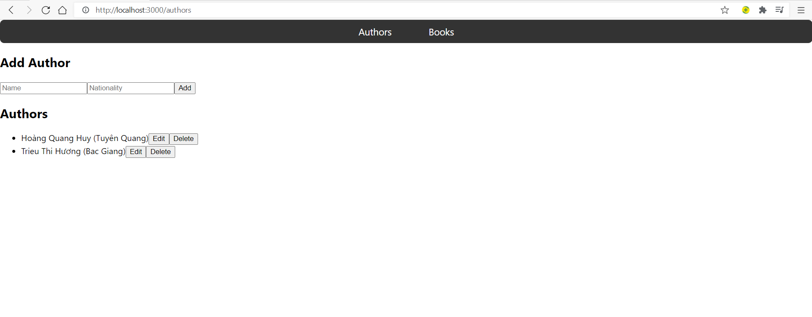

# Book Manager App

Như yêu cầu của công ty thì tôi đã chọn sử dụng Spring boot để code phần mềm này.
Đây là một ứng dụng full-stack với ReactJS ở frontend và Spring Boot ở backend.

## Chức năng
- Quản lý sách
- Quản lý tác giả
- Các thao tác CRUD (Tạo, Đọc, Cập nhật, Xóa) cho sách và tác giả

## Frontend
- Xây dựng với ReactJS
- Sử dụng Axois để call API bên phía backend Spring Boot

## Backend
- Xây dựng với Spring Boot
- Cung cấp các endpoint API REST để quản lý sách và tác giả

## Cài đặt

### Frontend
1. Sử dụng gitclone hoặc download trực tiếp file zip về.
2. sau đó cd vào thư mục chứa dự án của bạn hoặc bạn có thể mở trực tiếp dự án trên trình soạn thảo code như vscode,....
3. Chạy `npm install` để cài đặt các phụ thuộc.
4. Chạy `npm start` để khởi động server phát triển.

### Backend
1. Điều hướng đến thư mục `backend`.
2. Chạy `mvn install` để build dự án.
3. Chạy `mvn spring-boot:run` để khởi động server backend.

### Ảnh sản phẩm

